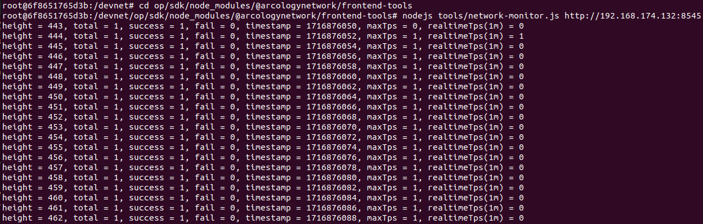

## L2 Rollup setup

This document guides you through the process of setting up an Arcology development network as an Ethereum L2 rollup. The network is configured for use as a single node and is intended solely for testing and development purposes.

The package contains the following major components:

- An Ethereum L1 
- An Optimism bridge
- An Arcology parallel execution node

### 1. Overview


### 2. Deployment Options

The networks can either be deployed in docker containers or on local machines. Please refer to the following 
sections for detailed instructions:

- [Docker containers](./l2-docker.md)
- [Local Deployment](./l2-local.md)

### 3. Network Status(optional)

At this point, the L1 and L2 networks are up and running. We can check the network status to see if it is running properly. On the machine that is running the L2 network.

>>:bulb: **If you are using the docker deployment, log in to the container first:**
>>```shell
>>    devnet> docker exec -it l2 /bin/bash
>>```

#### 3.1. Monitoring

Then run the following command to check the network status, assuming the IP address is `192.168.174.132`:
```shell
    devnet> cd op/sdk/node_modules/@arcologynetwork/frontend-tools
    devnet/op/sdk/node_modules/@arcologynetwork/frontend-tools> nodejs tools/network-monitor.js http://192.168.174.132:8545
```

#### 3.2. Output

You should be able to see the the network producing empty blocks, similar to the following:



### 4. Interacting with the Network

Once the network is up and running, you can interact with it using the SDK. Please refer to the [SDK documentation](../op/sdk/README.md) for more information on how to interact with the networks.

